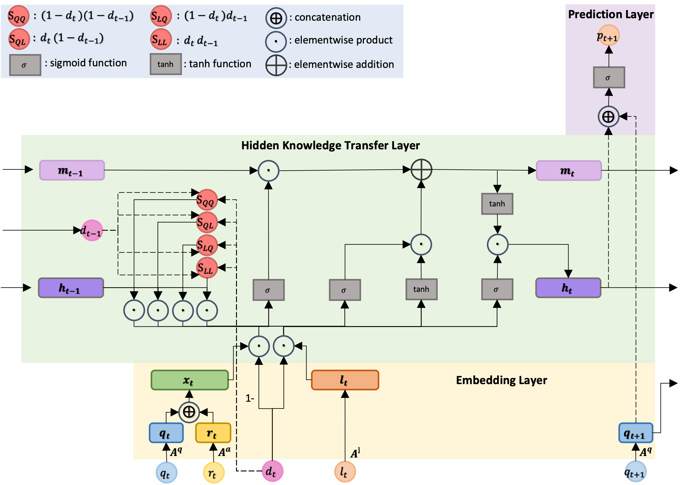

# Transition-Aware Multi-Activity Knowledge Tracing (TAMKOT)
Code for our paper:

 S. Zhao, C. Wang, and S. Sahebi. Transition-Aware Multi-Activity Knowledge Tracing. In Proceedings of 2022 IEEE International Conference on Big Data (Big Data).

If you have any questions, please email szhao2@albany.edu

## TAMKOT Network Architecture:




## Prerequisit
```angular2html
numpy
torch
scipy
sklearn
pickle
more_itertools
easydict
matplotlib
```

### How to install and run

```angular2html
git clone https://github.com/persai-lab/BigData2022-TAMKOT
cd BigData2022-TAMKOT
conda env create -f environment.yml
source init_env.sh
python run.py
```


## Cite:

Please cite our paper if you use this code in your own work:

```
@inproceedings{zhao2022tamkot,
  title={Transition-Aware Multi-Activity Knowledge Tracing},
  author={Zhao, Siqian and Wang, Chunpai and Sahebi,Shaghayegh},
  booktitle={2022 IEEE International Conference on Big Data (Big Data)},
  pages={},
  year={2022},
  organization={IEEE}
}
```

## Collarators:
```angular2html
Siqian Zhao: szhao2@albany.edu
Chunpai Wang: cwang25@albany.edu
Sherry Sahebi: ssahebi@albany.edu
```

## Acknowledgement:

This paper is based upon work supported by the National Science Foundation under Grant No. 2047500.